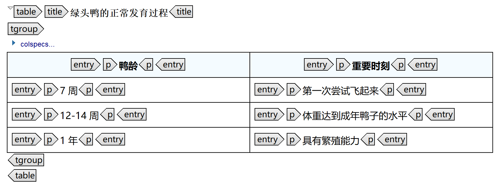

# 插入表格

使用`<table>`元素创建以下表格：

- 大型表格
- 格式特别复杂的表格
- 有标题的表格
- 有多个标题行的表格

`<table>`元素中的常用元素有：

| 元素 | 说明 |
|---|---|
| `<title>` | 表格标题。在一个`<table>`元素中，最多只能有一个`<title>`元素。 |
| `<tgroup>` | 表格的主体。在`<tgroup>`元素中，可以包含`<colspec>`、`<thead>`和`<tbody>`元素。一个`<table>` 元素中可以有一个或多个`<tgroup>`元素。 |
| `<colspec>` | 表格的列参数（提供与表格列有关的信息）。列参数有三个属性：`colname`（列名）、`colnum`（列号）和`colwidth`（相对列宽）。 |
| `<thead>` | 表格中的标题行。一个`<thead>`元素中可以有一个或多个`<row>`元素。 |
| `<tbody>` | 表格中的数据区。一个`<tbody>`元素中可以有一个或多个`<row>`元素。 |
| `<row>` | 表格中的数据行。一个`<row>`元素中都可以有一个或多个`<entry>`元素。 |
| `<entry>` | 表格中的单元格。在`<table>`元素中，`<entry>`元素是用来盛放单元格内容的。根据最佳实践，单元格中的文本应该放在`<p>`元素中。 |

本讲的主要内容是`<table>`元素的基本用法。为了让`<table>`和`<simpletable>`元素之间的区别更显而易见，`<table>`元素的练习文件与`<simpletable>`一模一样。



/// caption
示例：在可视模式下编辑表格
///

## 随堂练习

<!-- !!! note "注意"
    视频中使用了另一种方法在DITA中插入表格： [oXygen XML Editor](https://oxygenxml.com/) 表格向导。本次练习将教你如何使用代码在DITA中插入表格。 -->

1. 打开上一节使用的练习文件 `lesson2/l_concept_images_tables_start.dita`。

2. 在 `<simpletable>` 元素的后面，插入一个 `<table>` 元素如下：

    !!! note "注意"
        如果你使用的是支持DITA的编辑器，当你按照示例练习时，编辑器可能会在`<table>`元素中自动插入一些子元素。

    ```xml
    <?xml version="1.0" encoding="UTF-8"?>
    <!DOCTYPE concept PUBLIC "-//OASIS//DTD DITA Concept//EN" "concept.dtd">
    <concept id="concept_images_tables">
      <title>小鸭子的生长发育</title>
      <conbody>
        ...
        </simpletable>
        <table>
        </table>
      </conbody>
    </concept>
    ```

3. 在 `<table>` 元素中，插入一个 `<title>` 元素，并添加内容如下：

    ```xml
    <?xml version="1.0" encoding="UTF-8"?>
    <!DOCTYPE concept PUBLIC "-//OASIS//DTD DITA Concept//EN" "concept.dtd">
    <concept id="concept_images_tables">
      <title>小鸭子的生长发育</title>
      <conbody>
        ...
        <table>
          <title>绿头鸭的正常发育过程</title>
        </table>
      </conbody>
    </concept>
    ```

    `<title>` 元素是可选元素，可以为表格添加上下文信息，与在 `<fig>` 元素中使用它为图片添加标题一样。

4. 在 `<title>` 元素的后面，插入一个 `<tgroup>` 元素如下：

    ```xml
    <?xml version="1.0" encoding="UTF-8"?>
    <!DOCTYPE concept PUBLIC "-//OASIS//DTD DITA Concept//EN" "concept.dtd">
    <concept id="concept_images_tables">
      <title>小鸭子的生长发育</title>
      <conbody>
        ...
        <title>绿头鸭的正常发育过程</title>
        <tgroup cols="2">
        </tgroup>
        ...
      </conbody>
    </concept>
    ```

    `<tgroup>` 元素是表格的主体。`<tgroup>` 元素有一个 `cols` 属性，可以用来设置表格的列数。在本例中，`col="2"` 表示这个表格有两列。

    一个 `<table>` 元素中可以有多个 `<tgroup>` 元素。如此以来，多个标题行不同的表格或者列数不同的表格也可以共用一个标题。

5. 在 `<tgroup>` 元素中，插入两个 `<colspec>` 元素，并添加内容如下：

    ```xml
    <?xml version="1.0" encoding="UTF-8"?>
    <!DOCTYPE concept PUBLIC "-//OASIS//DTD DITA Concept//EN" "concept.dtd">
    <concept id="concept_images_tables">
      <title>小鸭子的生长发育</title>
      <conbody>
        ...
        <tgroup cols="2">
          <colspec colname="c1" colnum="1" colwidth="1.0*"/>
          <colspec colname="c2" colnum="2" colwidth="1.0*"/>
        ...
      </conbody>
    </concept>
    ```

    `<colspec>` 元素使用属性为表格设置列参数，比如列名、列号和列宽。在本例中，`colname` 属性将两个表格列分别命名为 `c1` 和 `c2`，`colnum` 属性则指定了两个表格列的前后顺序。

    `colwidth` 属性是一个可选属性，用来控制各个表格列的相对列宽。在本例中，各个表格列的 `colwidth` 属性拥有相同的属性值，表示它们的列宽相等。

6. 在最后一个 `<colspec>` 元素的后面，插入一个 `<thead>` 元素如下：

    ```xml
    <?xml version="1.0" encoding="UTF-8"?>
    <!DOCTYPE concept PUBLIC "-//OASIS//DTD DITA Concept//EN" "concept.dtd">
    <concept id="concept_images_tables">
      <title>小鸭子的生长发育</title>
      <conbody>
        ...
        <colspec colname="c2" colnum="2" colwidth="1.0*"/>
        <thead>
        </thead>
        ...
      </conbody>
    </concept>
    ```

    `<thead>` 元素可以为表格添加标题行。与 `<simpletable>` 元素的子元素 `<sthead>` 不同，`<thead>` 元素中可以包含多个标题行。

7. 在 `<thead>` 元素中，插入一个 `<row>` 元素如下：

    ```xml
    <?xml version="1.0" encoding="UTF-8"?>
    <!DOCTYPE concept PUBLIC "-//OASIS//DTD DITA Concept//EN" "concept.dtd">
    <concept id="concept_images_tables">
      <title>小鸭子的生长发育</title>
      <conbody>
        ...
        <thead>
          <row>
          </row>
        ...
      </conbody>
    </concept>
    ```

    `<row>` 元素代表表格中的一行，即表格行。

8. 在 `<row>` 元素中，插入两个 `<entry>` 元素，并添加内容如下：

    ```xml
    <?xml version="1.0" encoding="UTF-8"?>
    <!DOCTYPE concept PUBLIC "-//OASIS//DTD DITA Concept//EN" "concept.dtd">
    <concept id="concept_images_tables">
      <title>小鸭子的生长发育</title>
      <conbody>
        ...
        <row>
          <entry><p>鸭龄</p></entry>
          <entry><p>重要时刻</p></entry>
        </row>
        ...
      </conbody>
    </concept>
    ```

    每个 `<entry>` 元素都代表表格行中的一个单元格。在本例中，按照最佳实践，`<entry>` 元素中的文本都放在了 `<p>` 元素里。

9. 在 `<thead>` 元素的后面，插入一个 `<tbody>` 元素如下：

    ```xml
    <?xml version="1.0" encoding="UTF-8"?>
    <!DOCTYPE concept PUBLIC "-//OASIS//DTD DITA Concept//EN" "concept.dtd">
    <concept id="concept_images_tables">
      <title>小鸭子的生长发育</title>
      <conbody>
        ...
        </thead>
        <tbody>
        </tbody>
        ...
      </conbody>
    </concept>
    ```

    `<tbody>` 元素是表格的数据区。和 `<thead>` 元素的结构类似，`<tbody>` 元素中可以包含 `<row>` 元素，`<row>` 元素中可以包含 `<entry>` 元素。

10.  在 `<tbody>` 元素中，插入一个 `<row>` 元素，并添加内容如下：

    ```xml
    <?xml version="1.0" encoding="UTF-8"?>
    <!DOCTYPE concept PUBLIC "-//OASIS//DTD DITA Concept//EN" "concept.dtd">
    <concept id="concept_images_tables">
      <title>小鸭子的生长发育</title>
      <conbody>
        ...
        <tbody>
          <row>
            <entry><p>7 周</p></entry>
            <entry><p>第一次尝试飞起来</p></entry>
          </row>
        ...
      </conbody>
    </concept>
    ```

11.  在刚刚插入的 `<row>` 元素的后面，再插入两个 `<row>` 元素，并添加内容如下：

    ```xml
    <?xml version="1.0" encoding="UTF-8"?>
    <!DOCTYPE concept PUBLIC "-//OASIS//DTD DITA Concept//EN" "concept.dtd">
    <concept id="concept_images_tables">
      <title>小鸭子的生长发育</title>
      <conbody>
        ...
        </row>
        <row>
          <entry><p>12-14 周</p></entry>
          <entry><p>体重达到成年鸭子的水平</p></entry>
        </row>
        <row>
          <entry><p>1 年</p></entry>
          <entry><p>具有繁殖能力</p></entry>
        </row>
        ...
      </conbody>
    </concept>
    ```

    一个 `<tbody>` 元素中可以有一个或多个 `<row>` 元素。

12. 对照[随堂练习的参考答案] (`lesson2/l_concept_images_tables.dita`)，自行批改一下你刚刚完成的练习作业 (`lesson2/l_concept_images_tables_start.dita`)。

## 课后练习

1. 打开文件`lesson2/l_concept_images_tables_exercise_start.dita`，使用该文件将以下内容转换成DITA：

    在本次练习中用到的图片是`lesson2/images/configurebetter1.png`。

    --8<-- "div_exercise_content.md:start"

    <h2 style="margin: .64em 0 .64em;">让技术内容服务于市场营销</h2>

    长久以来，技术传播与市场营销一直处在内容光谱的两端。人们总是认为，技术文档排版粗糙、晦涩难懂，里面挤满了密密麻麻的文字；而宣传资料设计精美、赏心悦目，但却言之无物。关于这一点，争议愈演愈烈:

    |        对比项         |  技术文档  |   宣传资料   |
    |:-----------------|:----------:|:------------:|
    | 关注点           | 自动化 |      设计        |
    | 内容的详细程度   | 越详细越好 |  越简略越好  |
    | 对营收的预期影响 |     无     |     很大     |
    | 核心目的         |  传达信息  | 说服人们购买 |

    /// caption
    技术文档和宣传资料的刻板印象
    ///
     
     为用户提供一个友好的界面，可以让他们快速缩小选择范围，找到自己想要的东西。你不需要显示数据库里的所有字段，只显示那些能帮助用户缩小选择范围的字段就行。

    

    /// caption
    当你在左侧进行选择时，右侧的产品列表会实时更新
    ///

    --8<-- "div_exercise_content.md:end"

2. 对照[课后练习的参考答案] (`lesson2/l_concept_images_tables_exercise.dita`)，自行批改一下你刚刚完成的练习作业 (`lesson2/l_concept_images_tables_start.dita`)。

[随堂练习的参考答案]: sa_concept_images_tables.md#_2
[课后练习的参考答案]: sa_concept_images_tables.md#_3